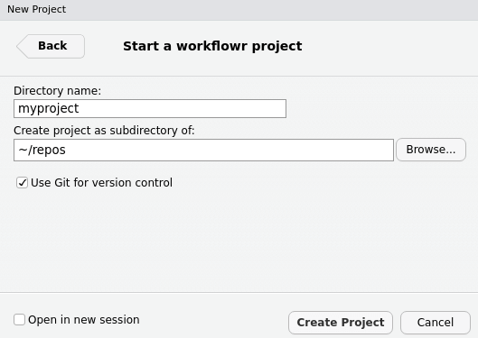
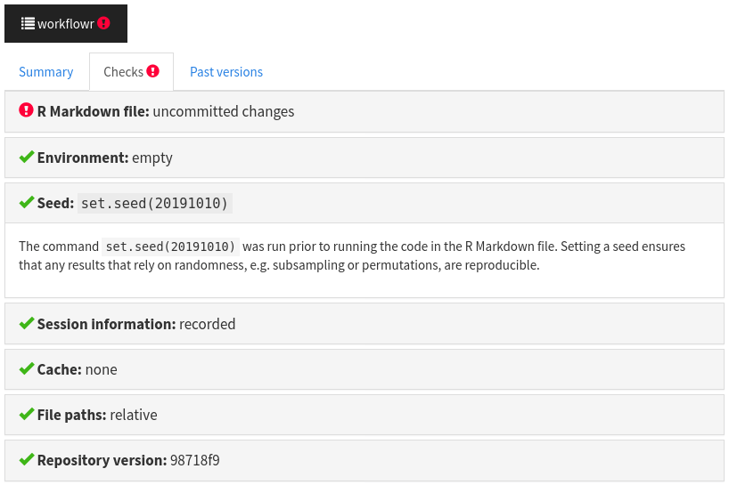
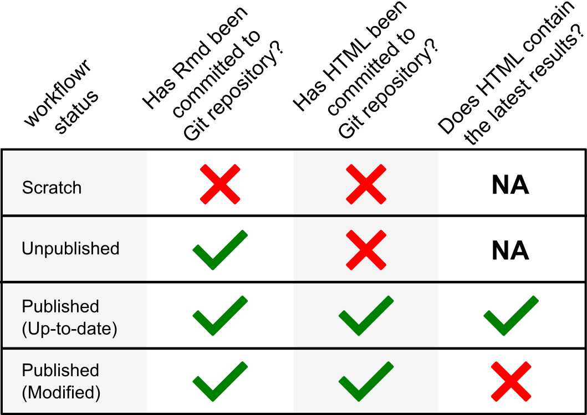

```{r setup, include=FALSE}
knitr::opts_chunk$set(eval = FALSE, fig.align = "center")
```

## Introduction

The [workflowr][] R package makes it easier for you to organize, reproduce, and
share your data analyses. This short tutorial will introduce you to the
workflowr framework. You will create a workflowr project that implements a small
data analysis in R, and by the end you will have a working website that you can
use to share your work. If you are completing this tutorial as part of a live
workshop, please follow the [setup instructions](#setup) in the next section
prior to arriving.

Workflowr combines literate programming with [R Markdown][rmd] and version
control with [Git][git] to generate a website containing time-stamped,
versioned, and documented results. By the end of this tutorial, you will have a
website hosted on [GitHub Pages][gh-pages] that contains the results of a
reproducible statistical analysis.

[gh-pages]: https://pages.github.com/
[git]: https://git-scm.com/
[rmd]: http://rmarkdown.rstudio.com/
[workflowr]: https://github.com/jdblischak/workflowr

## Setup

1. Install [R][r]

1. Install [RStudio][rstudio]

1. Install workflowr from [CRAN][cran]:

    ```r
    install.packages("workflowr")
    ```

1. Create an account on [GitHub][gh]

To minimize the possibility of any potential issues with your computational
setup, you are encouraged to update your version of RStudio (`Help` -> `Check
for Updates`) and update your R packages:

```{r update-packages, eval=FALSE}
update.packages()
```

If you do encounter any issues during the tutorial, consult the
[Troubleshooting](#troubleshooting) section for solutions to the most common
problems.

[cran]: https://cran.r-project.org/package=workflowr
[gh]: https://github.com
[r]: https://cran.r-project.org
[rstudio]: https://www.rstudio.com/products/rstudio/download/

## Organize your research

To help you stay organized, workflowr creates a project directory with the
necessary configuration files as well as subdirectories for saving data and
other project files. This tutorial uses the [RStudio project
template][rstudio-proj-template] for workflowr, but note that the same can be
achieved via the function `wflow_start()`.

[rstudio-proj-template]: https://rstudio.github.io/rstudio-extensions/rstudio_project_templates.html

To start your workflowr project, follow these steps:

1. Open RStudio.

1. In the R console, run `wflow_git_config()` to register your name and email
with Git. This only has to be done once per computer. If you've used Git
on this machine before, you can skip this step. For a better GitHub experience,
use the same email you used to register your GitHub account.

    ```{r config}
    library(workflowr)
    wflow_git_config(user.name = "First Last", user.email = "email@domain.com")
    ```

1. In the menu bar, choose `File` -> `New Project`.

1. Choose `New Directory` and then scroll down the list of project types to
select `workflowr project`. If you don't see the workflowr project template, go
to [Troubleshooting](#missing-template).

    ```{r rstudio-create-project, eval=TRUE, echo=FALSE, out.width = "50%"}
    knitr::include_graphics("img/rstudio-create-project.png")
    ```

    ```{r rstudio-project-type, eval=TRUE, echo=FALSE, out.width = "50%"}
    knitr::include_graphics("img/rstudio-project-type.png")
    ```

1. Type `myproject` as the directory name, choose where to save it on
your computer, and choose `Create Project`.

    ```{r rstudio-workflowr-template, eval=TRUE, echo=FALSE, out.width = "50%"}
    
    ```

1. RStudio executed `wflow_start()` to create the workflowr project `myproject`
and opened the project in RStudio. Note the workflowr directory structure
in the Files pane.

    ```
    myproject/
    |-- .gitignore
    |-- .Rprofile
    |-- _workflowr.yml
    |-- analysis/
    |   |-- about.Rmd
    |   |-- index.Rmd
    |   |-- license.Rmd
    |   |-- _site.yml
    |-- code/
    |   |-- README.md
    |-- data/
    |   |-- README.md
    |-- docs/
    |-- myproject.Rproj
    |-- output/
    |   |-- README.md
    |-- README.md
    ```

    The most important directory for you to  pay attention to now is the
    `analysis/` directory. This is where you should store all your analyses as R
    Markdown (Rmd) files. Other directories created for your convenience
    include `data/` for storing data, and `code/` for storing long-running or
    supplemental code you don't  want to include in an Rmd file. Note that the
    `docs/` directory is where the website HTML files will be created and stored
    by  workflowr, and should not be edited by the user.

1. In the R console, run `getwd()` to return the current working directory. Note
that it is set to the location of the workflowr project on your computer.
Every time you open this RStudio project (e.g. by clicking on `myproject.Rproj`),
it will change the working directory (as well as the Files pane) to this
directory. This allows you to use relative paths to files when performing your
analysis, which will make it easier for you and others to run the code on other
machines. In other words, instead of writing an absolute path like:

    ```{r absolute-path}
    d <- read.csv("C:/Users/GraceHopper/myproject/data/raw.csv")
    ```

    Instead you can write a relative path that will work for any user on any
    operating system:

    ```{r relative-path}
    d <- read.csv("data/raw.csv")
    ```

1. Open the file `analysis/index.Rmd` for editing. It should already be open in
the RStudio Editor pane from when you created the project. If not, use the Files
pane to navigate to the directory `analysis/` and click on `index.Rmd` to open
it for editing. This index file is special because it is used to create the home
page for your project. Write a short introductory message, e.g.  "Welcome to my
first workflowr website", and then save the file.

1. In the R console, run `wflow_build()`. This will build all the R Markdown
files in `analysis/`^[The default behavior when `wflow_build()` is run without
any arguments is to build any R Markdown file that has been edited since its
corresponding HTML file was last built.], save them in `docs/`, and then open
`docs/index.html` in the RStudio Viewer pane. Ignore the warnings in the
workflowr report for now; we will return to these later.

1. To begin your analysis, you will use a built-in data set from R.^[While not
the most realistic, this avoids any issues with downloading data from the
internet and saving it correctly.] The data set `ToothGrowth` contains the
length of the teeth for 60 guinea pigs given 3 different doses of vitamin C
either via orange juice (`OC`) or directly with ascorbic acid (`VC`). To
explore the data set, run the following in the R console.

    ```{r teeth, eval=TRUE}
    data("ToothGrowth")
    summary(ToothGrowth)
    str(ToothGrowth)
    ```

1. To mimic a real project that will have external data files, save the
`ToothGrowth` data set to the `data/` subdirectory using `write.csv()`.

    ```{r teeth-write}
    write.csv(ToothGrowth, file = "data/teeth.csv")
    ```

## Create reproducible analyses

To demonstrate the reproducibility features of workflowr, you will perform a
small analysis.

1. In the R console, open a new R Markdown file with `wflow_open()`. It will
open automatically for editing in RStudio.

    ```{r open-teeth}
    wflow_open("analysis/teeth.Rmd")
    ```

    Rmd files allow you to mix text, code, and results in the same output document
    (which can be HTML, PDF, Word, and more). In order to accomplish this, it uses a
    specific layout and syntax. At the top of the document between the dashes `---`
    is the YAML^[[YAML](https://en.wikipedia.org/wiki/YAML) is a mini-language often
    used in configuration files.] header that contains metadata about the document
    such as the title. Code chunks^[You can insert a code chunk via the menu bar,
    `Code` -> `Insert Chunk`, or using the keyboard shortcut (`Ctrl`+`Alt`+`I` on
    Windows and Linux, `Command`+`Option`+`I` on macOS).] are specified using the
    syntax below:

    ````
    ```{r optional-chunk-name}`r ''`
    <code goes here>
    ```
    ````

    And the code chunks are executed in order from top to bottom. Any text
    outside of a code chunk is interpreted as prose that should not be executed
    as R code.

    The workflowr framework accepts any valid Rmd file that can be converted to
    HTML. In the YAML header, note that workflowr provides its own custom output
    format, `workflowr::wflow_html`. This function extends the default output
    format `html_document` from the rmarkdown package, and thus accepts all the
    same arguments. The only other minor difference is that `wflow_open()` adds
    the editor option `chunk_output_type: console`, which causes the code to be
    executed in the R console instead of within the document. If you'd prefer
    the results of the code chunks be embedded inside the document while you
    perform the analysis, you can delete those lines (note that this has no
    effect on the final results, only on the display within RStudio).

1. Copy the code chunk below and paste it at the bottom of the file `teeth.Rmd`.
The code imports the data set from the file you previously created^[Note that the default
working directory for a workflowr project is the root of the project. Hence the
relative path is `data/teeth.csv`. The working directory can be changed via the
workflowr option `knit_root_dir` in `_workflowr.yml`. See `?wflow_html` for more
details.]. Execute the code in the R console by clicking on the Run button or
using the shortcut `Ctrl`/`CMD`+`Enter`.

    ````
    ```{r import-teeth}`r ''`
    teeth <- read.csv("data/teeth.csv", row.names = 1)
    head(teeth)
    ```
    ````

    Note: if you copy and paste this chunk, make sure to remove any spaces
    before each of the backticks (` ``` `) so that they will be correctly
    recognized as indicating the beginning and end of a code chunk.

1. Next create some boxplots to explore the data. Copy the code chunk below and
paste it at the bottom of the file `teeth.Rmd`. Execute the code to see create
the plots.

    ````
    ```{r boxplots}`r ''`
    boxplot(len ~ dose, data = teeth)
    boxplot(len ~ supp, data = teeth)
    boxplot(len ~ dose + supp, data = teeth)
    ```
    ````

```{r test-boxplots, eval=TRUE, include=FALSE}
data("ToothGrowth")
teeth <- ToothGrowth
boxplot(len ~ dose, data = teeth)
boxplot(len ~ supp, data = teeth)
boxplot(len ~ dose + supp, data = teeth)
```

1. To compare the tooth length of the guinea pigs given orange juice versus
those given vitamin C, you could perform a [permutation-based statistical
test][permutation]. This involves comparing the observed difference in teeth
length due to the supplement method to the observed differences calculated from
random permutations of the data. The basic idea is that if the observed
difference is an outlier compared to the differences generated after permuting
the supplement method column, it is more likely to be a true signal not due to
chance alone. Copy the code chunk below, paste it at the bottom of of the file
`teeth.Rmd`, and execute it. It demonstrates the idea of a permutation^[You
won't implement the full permutation method in this tutorial.]:

    ````
    ```{r permute}`r ''`
    # Observed difference in teeth length due to supplement method
    mean(teeth$len[teeth$supp == "OJ"]) - mean(teeth$len[teeth$supp == "VC"])
    # Permute the observations
    supp_perm <- sample(teeth$supp)
    # Calculate mean difference in permuted data
    mean(teeth$len[supp_perm == "OJ"]) - mean(teeth$len[supp_perm == "VC"])
    ```
    ````

    [permutation]: https://en.wikipedia.org/wiki/Resampling_%28statistics%29#Permutation_tests

    ```{r test-permute, eval=TRUE, include=FALSE}
    # Observed difference in teeth length due to supplement method
    mean(teeth$len[teeth$supp == "OJ"]) - mean(teeth$len[teeth$supp == "VC"])
    # Permute the observations
    supp_perm <- sample(teeth$supp)
    # Caclculate mean difference in permuted data
    mean(teeth$len[supp_perm == "OJ"]) - mean(teeth$len[supp_perm == "VC"])
    ```

1. In the R console, run `wflow_build()`. Note the value of the observed difference
in the permuted data.

1. In RStudio, click on the Knit button. Has the value of the observed difference
in the permuted data changed? It should be identical. This is because workflowr
always sets the same seed prior to running the analysis.^[Note that everyone in
the workshop will have the same result because by default workflowr uses a seed that
is the date the project was created as YYYYMMDD. You can change this by editing
the file `_workflowr.yml`.] To better understand this behavior as well as the
other reproducibility safeguards and checks that workflowr performs for each
analysis, click on the workflowr button at the top and select the "Checks" tab.

    ```{r workflowr-report-checks, eval=TRUE, echo=FALSE, out.width = "75%"}
    
    ```

1. Navigate back to the file `analysis/index.Rmd`. If you closed it, you can
open it from the Files pane or run the following in the R console:

    ```{r open-index}
    wflow_open("analysis/index.Rmd")
    ```

1. Copy the line below and paste it at the bottom of the file
`analysis/index.Rmd`. This creates a hyperlink to the tooth analysis. The text
between the square brackets is displayed on the webpage, and the text in
parentheses is the relative path to the teeth webpage. Note that you don't need
to include the subdirectory `docs/` because `index.html` and `teeth.html` are
both already in `docs/`. Also note that you need to use the file extension
`.html` since that is the file that needs to be opened by the web browser.

    ```
    * [Teeth growth](teeth.html)
    ```

1. Run `wflow_build()` and then confirm that clicking on the link "Teeth growth"
takes you to your teeth analysis page.

1. In the R console, run `wflow_status()`. This will show you the status of each
of the Rmd files in your workflowr project. The status is determined by the Git
status of the Rmd file and its corresponding HTML file. The file `teeth.Rmd` is
classified as "Scratch" because it has not yet been committed (i.e. saved in a
snapshot). In contrast, the file `index.Rmd` has status "Unpublished" because
the Rmd file has been committed (an initial commit was made when the project was
first started) but not its corresponding HTML file.

    ```{r fig-status, eval=TRUE, echo=FALSE, out.width = "50%"}
    
    ```

1. In the R console, run the command below to "publish" your results
^[The command uses the wildcard character `*` to match all the Rmd files in
`analysis/`. If this fails on your computer, try running the more verbose command: `wflow_publish(c("analysis/index.Rmd", "analysis/teeth.Rmd", "data/teeth.csv"), message = "Analyze teeth growth")`]. The function
`wflow_publish()` performs three steps: 1) commits the files, 2) rebuilds the
Rmd files, and 3) commits the HTML and figure files. This guarantees that the
results in each HTML file is always generated from an exact, known version
of the Rmd file (you can see this version embedded in the workflowr report).
The second argument is the message that is associated with the Git commit.
This way you can better understand the motivation for each change that you
made when you review the development history of your project (e.g. with `git log`).

    ```{r publish-teeth-growth}
    wflow_publish(c("analysis/*Rmd", "data/teeth.csv"), message = "Analyze teeth growth")
    ```

1. Open the workflowr report of `teeth.html` by clicking on the button at the
top of the page. Navigate to the tab "Past versions". Note that the record
of all past versions will be saved here. Once the project has been added to
GitHub (you will do this in the next section), the "Past versions" tab will
include hyperlinks for convenient viewing of the past versions of the Rmd and
HTML files.

    ```{r workflowr-past-versions-1, eval=TRUE, echo=FALSE, out.width = "75%"}
    knitr::include_graphics("img/workflowr-past-versions-1.png")
    ```

## Share your results

To share your work, you will host the Git repository on GitHub and activate the
free service GitHub Pages to serve the static website in `docs/`.

1. In the R console, run the function `wflow_use_github()`. The only required
argument is your GitHub username. The name of the repository will automatically
be named the same as the directory containing the workflowr project, in this
case "myproject". When the function asks if you would like it to create the
repository on GitHub for you, enter `y` for "yes". This will open your web
browser so that you can authenticate with GitHub and then give permission for
workflowr to create the repository on your behalf. Additionally, this function
connects to your local repository with the remote GitHub repository and
inserts a link to the GitHub repository into the navigation bar. If this fails
to create a GitHub repository, go to [Troubleshooting](#no-repo).

    ```{r wflow-use-github}
    wflow_use_github("your-github-username")
    ```

1. To update your workflowr website to use GitHub links to past versions of the
files (as well as update the navigation bar to include the GitHub link),
republish the files.

    ```{r republish}
    wflow_publish(republish = TRUE)
    ```

1. To send your project to GitHub, run `wflow_git_push()`. This will prompt you
for your GitHub username and password. If this fails, go to
[Troubleshooting](#failed-push).

    ```{r wflow-git-push}
    wflow_git_push()
    ```

1. On GitHub, navigate to the Settings tab of your GitHub repository^[If your
GitHub repository wasn't automatically opened by `wflow_git_push()`, you can
manually enter the URL into the browser:
`https://github.com/username/myproject`.]. Scroll down to the section "GitHub
Pages". For Source choose "master branch /docs folder". After it updates, scroll
back down and click on the URL. If the URL doesn't display your website, go to
[Troubleshooting](#no-gh-pages).

    ```{r github-pages-settings, eval=TRUE, echo=FALSE, out.width = "75%"}
    knitr::include_graphics("img/github-pages-settings.png")
    ```

1. Navigate to the tooth analysis. Click on the links in the "Past versions"
tab to see the past results. Click on the HTML hyperlink to view the past
version of the HTML file. Click on the Rmd hyperlink to view the past version
of the Rmd file on GitHub.

    ```{r workflowr-past-versions-2, eval=TRUE, echo=FALSE, out.width = "75%"}
    knitr::include_graphics("img/workflowr-past-versions-2.png")
    ```

## Conclusion

You have successfully created and shared a reproducible research website. Using
the same workflowr commands, you can do the same for one of your own research
projects and share it with collaborators and colleagues.

To learn more about workflowr, you can read the following vignettes:

* [Customize your research website](wflow-02-customization.html)
* [Migrating an existing project to use workflowr](wflow-03-migrating.html)
* [How the workflowr package works](wflow-04-how-it-works.html)
* [Frequently asked questions](wflow-05-faq.html)
* [Hosting workflowr websites using GitLab](wflow-06-gitlab.html)
* [Sharing common code across analyses](wflow-07-common-code.html)
* [Alternative strategies for deploying workflowr websites](wflow-08-deploy.html)

## Troubleshooting

### I don't see the workflowr project as an available RStudio Project Type. {#missing-template}

If you just installed workflowr, close and re-open RStudio. Also, make sure you
scroll down to the bottom of the list.

### The GitHub repository wasn't created automatically by `wflow_use_github()`. {#no-repo}

If `wflow_use_github()` failed unexpectedly when creating the GitHub repository,
or if you declined by entering `n`, you can manually created the repository on
GitHub. After logging in to GitHub, click on the "+" in the top right of the
page. Choose "New repository". For the repository name, type `myproject`. Do not
change any of the other settings. Click on the green button "Create repository".
Once that is completed, you can return to the next step in the tutorial.

```{r github-new-repo, eval=TRUE, echo=FALSE, out.width="25%"}
knitr::include_graphics("img/github-new-repo.png")
```

### I wasn't able to push to GitHub with `wflow_git_push()`. {#failed-push}

Unfortunately this function has a high failure rate because it relies on the
correct configuration of various system software dependencies. If this fails,
you can push to Git using another technique, but this will require that you have
previously installed Git on your computer. For example, you can use the RStudio
Git pane (click on the green arrow that says "Push"). Alternatively, you can
directly use Git by running `git push` in the terminal.

### My website isn't displaying after I activated GitHub Pages. {#no-gh-pages}

It is not uncommon for there to be a short delay before your website is
available. One trick to try is to specify the exact page that you want at the
end of the URL, e.g. add `/index.html` to the end of the URL.
